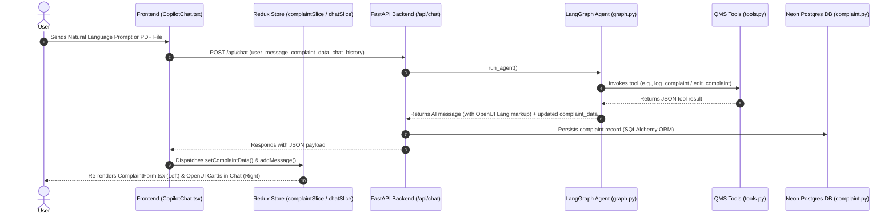

# AIVOA Customer Complaints Ingestion System - Product Specification & Architecture Document (`product.md`)

## 1. Executive Summary & Overview

The **AIVOA Customer Complaints Ingestion System** is a next-generation, AI-driven pharmaceutical Quality Management System (QMS) application built for pharmaceutical manufacturers operating under regulatory standards such as **FDA 21 CFR Part 211** and **ICH Q10**. 

The system features a **split-screen interface**:
- **Left Panel (55%)**: A read-only **Log Customer Complaint** form and Risk Assessment panel.
- **Right Panel (45%)**: An **AIVOA Co-pilot** AI chat assistant powered by **LangGraph**, **Groq LLM (`llama-3.3-70b-versatile`)**, and **OpenUI Lang** generative UI components.

> **Core Rule**: Users do NOT fill out form fields manually. Form fields and risk assessments are populated and modified exclusively through natural language prompts, document extractions (PDF/email), and tool calls executed by the AI co-pilot.

---

## 2. Technical Decisions & Architectural Rationale

### Why LangGraph for AI Agent Orchestration?
- **ReAct Loop with Stateful Memory**: LangGraph provides explicit StateGraph state management allowing the model to cycle through `agent_node` -> `tool_node` -> `process_results` cleanly while maintaining context across multi-turn user edits.
- **Deterministic Schema Ingestion**: Ensures tool calls (`log_complaint`, `edit_complaint`, `extract_document`, etc.) return typed data that guarantees 100% data integrity before updating database records.

### Why OpenUI Lang (Option B - Generative UI)?
- **Token Efficiency & Progressive Rendering**: OpenUI Lang uses streaming-first compact component definitions that reduce token consumption by up to 52% compared to standard JSON streams.
- **Dynamic In-Chat Components**: Enables the model to output rich visual elements (`<ComplaintCard />`, `<RiskGauge />`, `<CompletenessWidget />`) directly inside chat messages alongside standard Markdown.

### Why Redux Toolkit for Frontend State Management?
- **Single Source of Truth**: Complaint data returned by backend tool calls dispatches directly to the Redux store (`complaintSlice.ts`).
- **Unidirectional Reactive Data Flow**: Changes in Redux automatically re-render the left panel (`ComplaintForm.tsx`), maintaining strict read-only guarantees on the UI form.

### Why Neon Serverless PostgreSQL?
- **Relational Integrity for Quality Records**: QMS compliance requires structured schema definitions, timestamps, and audit-ready tracking.
- **Serverless Scaling & Instant Connection**: Seamlessly connects via SQLAlchemy ORM without local database setup overhead.

---

## 3. File-by-File Data Flow & Component Breakdown

### Backend File Structure & Data Flow

#### 1. `backend/main.py`
- **Role**: FastAPI application entry point.
- **Data Flow**: Initializes CORS middleware, triggers `Base.metadata.create_all()` to ensure PostgreSQL database tables exist on startup, and mounts backend routers (`/api/chat`, `/api/upload`, `/api/complaints`).

#### 2. `backend/config.py`
- **Role**: Centralized environment variable loader.
- **Data Flow**: Reads `GROQ_API_KEY`, `DATABASE_URL`, and `MODEL_NAME` from `.env` and provides fallback configurations.

#### 3. `backend/agent/graph.py`
- **Role**: LangGraph state machine definition.
- **Data Flow**: Defines `AgentState` containing message history, active complaint dictionary, and tool execution logs. Directs LLM execution through `agent_node` -> `should_continue` -> `tool_node` -> `process_results`.

#### 4. `backend/agent/tools.py`
- **Role**: QMS execution tools.
- **Data Flow**:
  - `log_complaint()`: Accepts extracted complaint parameters (including split `complainant_phone`, `complainant_email`, and `country_code`), calculates risk metrics, and returns JSON payload.
  - `edit_complaint()`: Takes existing complaint dictionary + partial edits, merges changes while preserving unmodified fields (including split contact fields), and returns updated JSON.
  - `extract_document()`: Converts parsed document text into structured complaint fields, extracting separate email, phone, and country code.
  - `assess_risk()`: Re-calculates severity level (Critical/Major/Minor), numerical risk score (1-100), root cause hypothesis, and CAPA recommendations.
  - `check_completeness()`: Evaluates required QMS fields (including phone, email, country code) and returns percentage completion score.
  - `request_missing_info()` **[NEW]**: Dedicated LangGraph tool invoked when key fields (e.g. `complainantEmail`, `complainantPhone`, `countryCode`) are missing during document or text ingestion. Generates OpenUI component syntax string `<MissingInfoForm title="..." fields="..." prompt="..." />` to prompt the user visually via an in-chat interactive form.

#### 5. `backend/agent/prompts.py`
- **Role**: System prompt definition (`SYSTEM_PROMPT`).
- **Data Flow**: Configures pharmaceutical QMS guidelines (ICH Q10, 21 CFR 211), severity classification rules, tool invocation instructions (including split contact field extraction and `request_missing_info` tool usage), and OpenUI Lang component markup formats (`<MissingInfoForm />`).

#### 6. `backend/schemas/complaint.py`
- **Role**: Pydantic schemas (`ComplaintData`, `ChatRequest`, `ChatResponse`, `UploadResponse`).
- **Data Flow**: Includes split contact fields `complainantPhone`, `complainantEmail`, and `countryCode` in `ComplaintData` to validate data exchanged between frontend and backend.

#### 7. `backend/models/complaint.py`
- **Role**: SQLAlchemy ORM Database Entity model (`Complaint`).
- **Data Flow**: Maps Python attributes (`complainant_phone`, `complainant_email`, `country_code`) to PostgreSQL table columns and returns them in `to_dict()`.

#### 8. `backend/routers/chat.py`
- **Role**: `/api/chat` REST endpoint.
- **Data Flow**: Receives `ChatRequest` from frontend, calls `run_agent()`, maps API fields (`complainantPhone`, `complainantEmail`, `countryCode`) to DB columns in `_save_complaint()`, persists updated complaint records into Neon PostgreSQL, and returns `ChatResponse`.

#### 9. `backend/routers/upload.py`
- **Role**: `/api/upload` REST endpoint.
- **Data Flow**: Receives PDF or text document uploads via `UploadFile`, uses `PyPDF2` to extract text, pipes text into `run_agent()`, saves database records, and returns extracted complaint data.

#### 10. `backend/routers/complaints.py`
- **Role**: `/api/complaints` CRUD REST endpoints.
- **Data Flow**: Provides endpoints to list past complaints, fetch complaint by ID, update status, and delete records.

---

### Frontend File Structure & Data Flow

#### 1. `frontend/src/App.tsx` **[ENHANCED]**
- **Role**: Main application layout & view switcher.
- **Data Flow**: Manages `activeView` state (`"list"` for Home ledger view vs `"form"` for split-screen AI Form view). Wraps application in Redux `<Provider>` and `<TooltipProvider>`, rendering `<Header />`, `<ComplaintsList />` on home view, and split-screen 55% `<ComplaintForm />` / 45% `<CopilotChat />` on form view.

#### 2. `frontend/src/components/ComplaintsList.tsx` **[NEW]**
- **Role**: Home Screen Paginated QMS Complaints Ledger.
- **Data Flow**: Fetches submitted complaints from `/api/complaints`. Displays a search filter, paginated data table (Product, Batch #, Category, Complainant, Severity, Risk Score, Date, Actions), rows per page selector, pagination controls (Previous / Next), and a prominent **"+ New Complaint"** action button that opens the split-screen Form interface.

#### 3. `frontend/src/components/Header.tsx` **[ENHANCED]**
- **Role**: Top navigation bar.
- **Data Flow**: Displays AIVOA QMS logo, model indicator badge, active Neon database status, **"+ New Complaint"** button, and **"← Complaints List"** back navigation button when viewing the Form interface.

#### 4. `frontend/src/store/store.ts` & `hooks.ts`
- **Role**: Redux store configuration and typed React hooks (`useAppDispatch`, `useAppSelector`).
- **Data Flow**: Combines `complaintReducer` and `chatReducer` into a unified global state.

#### 5. `frontend/src/store/complaintSlice.ts`
- **Role**: Redux state slice for active complaint fields.
- **Data Flow**: Defines `ComplaintState` interface with split contact fields `complainantPhone`, `complainantEmail`, and `countryCode`. Exposes `setComplaintData` (updates state from AI responses or in-chat form submissions) and `resetComplaint` (clears form).

#### 6. `frontend/src/store/chatSlice.ts`
- **Role**: Redux state slice for chat conversation history.
- **Data Flow**: Exposes `addMessage`, `setLoading`, `setUploading`, and `clearChat`.

#### 7. `frontend/src/services/api.ts`
- **Role**: Axios HTTP client service.
- **Data Flow**: Handles network calls to `http://localhost:8000/api` for `/chat`, `/upload`, and `/complaints`.

#### 8. `frontend/src/lib/openui.tsx` **[ENHANCED]**
- **Role**: OpenUI Lang parser and Generative UI component renderer module.
- **Data Flow**: Parses OpenUI Lang tags (`<ComplaintCard />`, `<RiskGauge />`, `<CompletenessWidget />`, `<MissingInfoForm />`) out of assistant message text using regex tokenization and converts them into styled React components.
- **Interactive Component**: Renders `<MissingInfoForm />` with interactive inputs:
  - Country Code `<select>` dropdown (`+1 (USA/Canada)`, `+44 (UK)`, `+91 (India)`, `+49 (Germany)`, etc.)
  - Phone Number input box (`type="tel"`)
  - Email Address input box (`type="email"`)
  - Dynamic text inputs for any missing field
  - **Submit Information** button with real-time callback dispatch to Redux and AI chat.

#### 9. `frontend/src/components/CopilotChat.tsx` **[ENHANCED]**
- **Role**: AI co-pilot chat container.
- **Data Flow**: Handles message input, file attachment selection, sends prompts to backend API, dispatches returned data to Redux, passes `handleFormSubmit` to OpenUI components, and renders chat bubbles with tool badges and OpenUI Generative UI components.

#### 10. `frontend/src/components/ComplaintForm.tsx` **[ENHANCED]**
- **Role**: Read-only complaint form panel (Left side).
- **Data Flow**: Subscribes to `state.complaint` via Redux. Uses `AnimatedFormField` to render Product Details, Batch Details, Complaint Info, Complainant Info (split into **Complainant Email**, **Country Code**, and **Complainant Phone**), Severity Badges, and Completeness meters dynamically.

#### 11. `frontend/src/components/AnimatedFormField.tsx` **[NEW]**
- **Role**: Typewriter & Eraser animation component with auto-scroll and emerald green highlight hue.
- **Data Flow**: Tracks previous vs. updated field values. When AI tool calling updates a field:
  - **Auto-scroll**: Automatically smoothly scrolls the form container to bring the modified field into focus.
  - **Green Hue Highlight**: Highlights the placeholder/field border with a glowing emerald green ring (`ring-2 ring-emerald-500 bg-emerald-500/10 shadow-[0_0_15px_rgba(16,185,129,0.3)]`).
  - **Typewriter / Eraser Cursor Animation**: Erases existing text character-by-character using an active typing cursor (`|`), then types out the new text character-by-character.

#### 12. `frontend/src/index.css`
- **Role**: Global design system stylesheet.
- **Data Flow**: Defines CSS custom properties, Google Inter typography, glassmorphism utilities, gradient backgrounds, responsive media queries, and keyframe animations (`greenHueGlow`, `typewriter-cursor`).

#### 13. `.gitignore` **[NEW]**
- **Role**: Root Git ignore configuration.
- **Data Flow**: Prevents committing Python `__pycache__`, virtual environments (`.env`, `venv/`), Node dependencies (`node_modules/`), build output (`dist/`), caches, and OS metadata.

---

## 4. Summary of Recent Feature Additions

1. **Split Contact Fields**:
   - `complainantContact` split into `countryCode` (e.g. `+1`, `+44`, `+91`), `complainantPhone`, and `complainantEmail`.
   - Updated database model, Pydantic schemas, Redux store, and left-panel `ComplaintForm.tsx`.

2. **LangGraph Missing Information Tool (`request_missing_info`)**:
   - Added `request_missing_info` tool in `backend/agent/tools.py` registered in `ALL_TOOLS`.
   - When PDF extraction or text ingestion detects missing fields, LangGraph invokes `request_missing_info` to generate an OpenUI form card.

3. **OpenUI Interactive In-Chat Form Component (`<MissingInfoForm />`)**:
   - Added `MissingInfoFormComponent` in `frontend/src/lib/openui.tsx`.
   - Renders interactive select dropdowns (Country Code), phone/email inputs, and a **Submit** button directly in the chat panel.
   - Submitting updates Redux `complaintSlice` instantly and sends confirmation to the AI agent.

4. **Animated Field Updates (Auto-Scroll, Eraser/Typewriter Cursor & Green Hue Glow)**:
   - Built `AnimatedFormField.tsx` component.
   - When AI tool calls modify any field, the form auto-scrolls to the field, glows with an emerald green hue, erases the old text character-by-character with a typing cursor `|`, and types out the new text.
   - Reruns AI analysis and generates refreshed OpenUI insights (`<RiskGauge />`, `<ComplaintCard />`, `<CompletenessWidget />`) in chat.

5. **Home Screen Paginated Complaints List & Form Navigation**:
   - Created `ComplaintsList.tsx` home screen with pagination controls, search filtering, and row actions.
   - Configured **"+ New Complaint"** button to open the split-screen form interface (`ComplaintForm` + `CopilotChat`).
   - Added **"← Complaints List"** header button for seamless navigation back to the home view.
