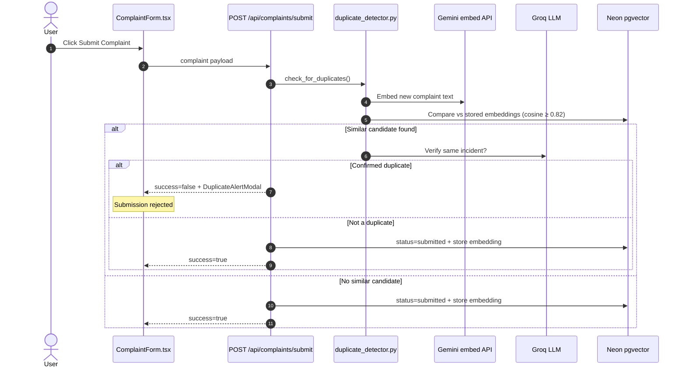

# AIVOA Customer Complaints Ingestion System - Product Specification & Architecture Document (`product.md`)

## 1. Executive Summary & Overview

The **AIVOA Customer Complaints Ingestion System** is a next-generation, AI-driven pharmaceutical Quality Management System (QMS) application built for pharmaceutical manufacturers operating under regulatory standards such as **FDA 21 CFR Part 211** and **ICH Q10**.

The system features a **split-screen interface**:
- **Left Panel (55%)**: A read-only **Log Customer Complaint** form, Risk Assessment panel, and **Submit Complaint** action.
- **Right Panel (45%)**: An **AIVOA Co-pilot** AI chat assistant powered by **LangGraph**, **Groq LLM** (configured model, currently `openai/gpt-oss-20b`), and **OpenUI Lang** generative UI components.

> **Core Rule**: Users do NOT fill out form fields manually. Form fields and risk assessments are populated and modified exclusively through natural language prompts, document extraction (PDF/email), and tool calls executed by the AI co-pilot. Document upload is opened from the **paperclip beside the chat input (right panel)**, not from the left form.

---

## 2. Technical Decisions & Architectural Rationale

### Why LangGraph for AI Agent Orchestration?
- **ReAct Loop with Stateful Memory**: Explicit StateGraph cycles `agent_node` → `tool_node` → `process_results`.
- **Extract-first narrative handling**: Long complaint letters force `log_complaint` before the model can ask questions, so extractable fields populate the left form immediately.
- **Flat tool arguments only**: Nested JSON tool args caused Groq `tool_use_failed` / JSON parse errors; tools now accept flat fields only and merge into agent state.

### Why OpenUI Lang (Option B - Generative UI)?
- Compact in-chat components: `<ComplaintCard />`, `<RiskGauge />`, `<CompletenessWidget />`, `<MissingInfoForm />`.
- Server-side normalization ensures `MissingInfoForm` lists **only currently blank** field keys (never re-asks filled fields).

### Why Redux Toolkit?
- Complaint data from tool calls dispatches to `complaintSlice`; left form stays read-only and reactive.

### Why Neon + pgvector?
- Relational QMS records in Neon PostgreSQL.
- **`pgvector` extension** stores Gemini embeddings as `vector(3072)` for duplicate retrieval (no re-embed of every historical row on each submit).

### Why Gemini Embeddings + Groq LLM for Duplicates?
- Stage 1: Embed complaint text with Google **`gemini-embedding-2`** (`GOOGLE_API_KEY`).
- Stage 2: Cosine similarity against persisted pgvector embeddings (threshold ≥ 0.82).
- Stage 3: Groq LLM confirms true duplicate; submission is **rejected** and the user is prompted.

---

## 3. End-to-End Data Flows

### 3.1 Chat / Narrative Ingestion

```mermaid
sequenceDiagram
    autonumber
    actor User
    participant CopilotChat as Frontend (CopilotChat.tsx)
    participant Redux as Redux Store
    participant Router as FastAPI (/api/chat)
    participant Agent as LangGraph (graph.py)
    participant Tools as QMS Tools
    participant DB as Neon + pgvector

    User->>CopilotChat: Pastes complaint narrative or chat prompt
    CopilotChat->>Router: POST /api/chat
    Router->>Agent: run_agent()
    Note over Agent: If form empty + narrative → force log_complaint
    Agent->>Tools: log_complaint / edit / assess_risk / check_completeness
    Tools-->>Agent: Flat field updates merged into complaint_data
    Agent-->>Router: OpenUI response + complaint_data
    Router->>DB: Save draft/logged row + refresh embedding
    Router-->>CopilotChat: ChatResponse
    CopilotChat->>Redux: setComplaintData + addMessage
    Redux-->>User: Left form populated; MissingInfoForm only for true blanks
```

### 3.2 Submit + Duplicate Detection



---

## 4. File-by-File Breakdown

### Backend

#### `backend/main.py`
- FastAPI entry; CORS; mounts `/api/chat`, `/api/upload`, `/api/complaints`.
- Startup auto-migration: contact columns + **`CREATE EXTENSION vector`** + `embedding vector(3072)`, `embedding_model`, `embedding_updated_at`.

#### `backend/config.py`
- Loads `GROQ_API_KEY`, `DATABASE_URL`, `MODEL_NAME`, `GOOGLE_API_KEY` from `backend/.env` (path-resolved).

#### `backend/agent/graph.py`
- LangGraph ReAct agent with:
  - FILLED vs MISSING field guides injected into context.
  - **Force `tool_choice=log_complaint`** when left form lacks core data and user message looks like a complaint narrative.
  - Completeness computed in-process (not via fragile nested JSON).
  - `_normalize_missing_info_form()` rewrites OpenUI missing fields to actual blanks only.

#### `backend/agent/tools.py`
- `log_complaint`, `edit_complaint` (partial flat updates only), `extract_document`, `assess_risk` (flat risk fields only), `check_completeness` (no args), `request_missing_info`.
- Phone/`+countryCode` parser for split contact fields.

#### `backend/agent/prompts.py`
- Extract-first workflow: populate form via tools **before** asking questions.
- Date/location inference rules (e.g. `11 September 2026` → `2026-09-11`, India/Pune → `+91`).

#### `backend/services/duplicate_detector.py`
- Gemini embedding + cosine retrieval + Groq verification.
- `generate_and_store_embedding()`, `reembed_all_complaints()` for pgvector persistence/backfill.

#### `backend/models/complaint.py`
- ORM entity including split contacts and **`embedding = Vector(3072)`** (pgvector).

#### `backend/routers/chat.py` / `upload.py`
- Persist complaint rows and refresh embeddings on save.

#### `backend/routers/complaints.py`
- CRUD + **`POST /api/complaints/submit`** with duplicate rejection path.
- On success: `status=submitted` and embedding stored.

#### `backend/scripts/reembed_complaints.py`
- One-shot migrate + re-embed all existing complaints into pgvector.

### Frontend

#### `frontend/src/App.tsx`
- View switcher: complaints list vs split form; URL routes `/complaints`, `/complaints/new`, `/complaints/[id]`.

#### `frontend/src/components/ComplaintForm.tsx`
- Read-only form + **Submit Complaint** bar.
- Calls `submitComplaint()`; opens `DuplicateAlertModal` and rejects on duplicate.

#### `frontend/src/components/DuplicateAlertModal.tsx`
- Shows embedding similarity + LLM confidence; primary action **Reject & Review Record**.

#### `frontend/src/components/CopilotChat.tsx`
- Chat + **right-panel file upload section** toggled by paperclip (drag/drop, sample email, extract).

#### `frontend/src/lib/openui.tsx`
- Parses/renders generative UI including interactive `<MissingInfoForm />`.

#### `frontend/src/services/api.ts`
- `/chat`, `/upload`, `/complaints`, `/complaints/submit`.

---

## 5. Problems Encountered & Fixes

| Problem | Root cause | Fix |
|--------|------------|-----|
| File upload felt like a left-panel action | Empty-state UI looked like a dropzone | Moved upload UX to **right chat paperclip**; left form remains read-only with guidance text |
| Groq model `llama-3.3-70b-versatile` 404 | Model no longer available on Groq account | Switched `MODEL_NAME` to available tool-capable model (`openai/gpt-oss-20b`) |
| `tool_use_failed` / Failed to parse tool call arguments as JSON | Nested JSON blobs passed into `assess_risk` / `edit_complaint` / `check_completeness` | Flattened tool schemas; merge into agent state; completeness computed server-side |
| Co-pilot re-asked already filled fields | Prompt + OpenUI listed stale missing keys | FILLED/MISSING context; normalize `MissingInfoForm` after each turn |
| Long narrative asked every field without populating form | Model answered with questions before tools | Force `log_complaint` on empty form + narrative; extract-first system prompt |
| `UndefinedColumn: complainant_phone` | ORM fields ahead of Neon schema | Startup `ALTER TABLE ... ADD COLUMN IF NOT EXISTS` migration |
| Embeddings not visible in Neon | Detector re-embedded in-memory only | Enabled **pgvector**, added `embedding vector(3072)`, persisted on chat/upload/submit, backfilled all rows |
| Duplicate submit UX unclear | Detection existed but UI not wired / force-submit confusing | Submit button + modal; **reject** duplicates by default |

---

## 6. Database Schema (Neon)

Core complaint fields plus:

```sql
-- Contact split
complainant_phone VARCHAR(100)
complainant_email VARCHAR(255)
country_code VARCHAR(20)

-- Duplicate retrieval (pgvector)
CREATE EXTENSION IF NOT EXISTS vector;
embedding vector(3072)
embedding_model VARCHAR(100)          -- e.g. gemini-embedding-2
embedding_updated_at TIMESTAMP
```

Verify embeddings:

```sql
SELECT id, product_name, embedding_model,
       vector_dims(embedding) AS dims, embedding_updated_at
FROM complaints;
```

---

## 7. Product Rules (Current)

1. **Left form is read-only** — AI (and MissingInfoForm) write fields; humans submit.
2. **Upload only from right chat** paperclip / dropzone.
3. **Narrative → extract first** — never quiz the user for data already in the message.
4. **Ask only true blanks** after tools update the record.
5. **Submit** runs Gemini + pgvector retrieval + LLM verification; duplicates are rejected.
6. **Every saved complaint should carry a stored embedding** for future duplicate checks.

---

## 8. Verification Snapshot

- Frontend builds cleanly via `npm run build`.
- Backend: FastAPI + LangGraph + Groq tools + Gemini embeddings + Neon pgvector.
- Narrative smoke test: Cardiwel-5 letter forces `log_complaint`, populates product/batch/dates/category/description/risk, then asks only remaining blanks (contact, lot, manufacturing date, etc.).
- Re-embed script: all existing complaints backfilled (`dims=3072`, `embedding_model=gemini-embedding-2`).
